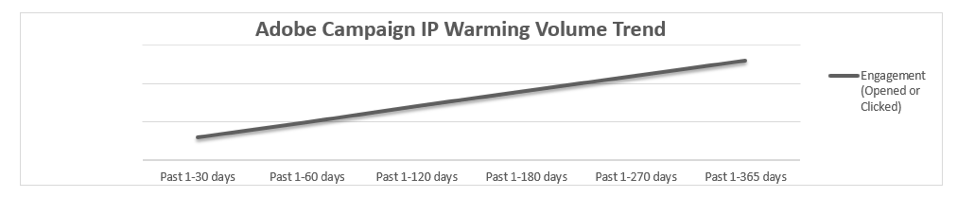

# Aumentare la reputazione e-mail con la preparazione degli indirizzi IP

<!--Increase your email reputation with IP warming

## IP Warming overview

In the Adobe Deliverability Consulting and Deliverability Operations teams, we have a vested interest in helping new Campaign customers be as successful as possible as they embark on the route of an IP warming process. If you’ve never been a part of such a project, you may have a lot of questions about it. Let’s get down to the details!-->

## Introduzione

Adobe richiede ai clienti di condividere la propria configurazione per aiutare il team di recapito messaggi di Adobe a comprendere il tuo programma univoco. Le domande che poniamo sono progettate per aiutare il team di recapito messaggi di Adobe a comprendere la tua reputazione e il volume delle tue e-mail. Senza una comprensione concreta del modello di business, degli obiettivi di e-mail marketing e delle metriche di reputazione, non saremo in grado di personalizzare la strategia e vi è il rischio di problemi di consegna.

All’inizio, ti saranno assegnati i tuoi indirizzi IP (Internet Protocol) dedicati. Nel contesto dell’invio di e-mail, un indirizzo IP è il percorso utilizzato per inviare i messaggi e-mail ai clienti. Gli indirizzi IP e i domini vengono utilizzati per identificare i mittenti su una rete agli ISP riceventi. Adobe assegna il numero appropriato di indirizzi IP dedicati per l’invio di e-mail, in base al volume di invio, ai programmi e-mail, alle pratiche di segmentazione dei dati e al contratto.

**Argomenti correlati:**
* [Effettuare una transizione fluida quando si passa da una piattaforma e-mail a un’altra](../../help/transition-process/switching-email-platforms.md)
* [Strategia IP](../../help/transition-process/infrastructure.md#ip-strategy)
* [Considerazioni specifiche dell’ISP durante il riscaldamento dell’IP](../../help/transition-process/isp-specific-considerations-during-ip-warming.md)

## Riscaldamento IP: perché è fatto? {#why-ip-warming}

I provider di servizi Internet (ISP) o i provider di cassette postali (MBP) adottano precauzioni quando rilevano un IP sconosciuto e un dominio di invio. Questa è la procedura standard associata a qualsiasi nuovo IP di invio, indipendentemente dal tipo di mittente. ISP/MBP sottopongono l’IP e il dominio di invio a un’analisi approfondita per determinare se le e-mail inviate da questo IP e dal dominio sono spam o meno.  Questa è la procedura standard associata a qualsiasi nuovo IP di invio, indipendentemente dal tipo di mittente.

Gli ISP esaminano attentamente il volume di invio, la frequenza di invio, i reclami e le percentuali di mancato recapito generate da queste comunicazioni. Questi sono tutti controllati attentamente perché sono indicatori di reputazione del mittente - sia esso buono o cattivo.

Naturalmente, questo processo di esame di questi punti di dati richiede tempo, e non può essere raggiunto in uno o due giorni. La reputazione si costruisce nel tempo. Questo processo è come lasciare uno straniero in casa tua. Avresti delle riserve sull&#39;ingresso a casa di qualcuno che non hai mai incontrato?

Molto probabilmente la risposta è sì. Vorreste analizzare questa persona e le sue motivazioni. Intendete fare del male? Sono una minaccia? Gli ISP fanno lo stesso per proteggere la propria rete da traffico dannoso o indesiderato. Le metriche di reputazione positive consentono di compiere grandi progressi in un processo di riscaldamento dell’IP di successo. Per questo sottolineiamo l’importanza di iniziare con l’invio di piccoli volumi di e-mail e di iniziare a inviare prima ai tuoi clienti altamente coinvolti. Per ulteriori informazioni, consulta [Criteri di targeting per l’invio di nuovo traffico](/help/transition-process/targeting-criteria.md).

L’invio di grandi quantità di e-mail da un nuovo IP o IP direttamente dal gate è una pratica scorretta e probabilmente causerà alcune difficoltà di recapito dei messaggi. È importante notare che, anche se inizi a inviare volumi di piccole dimensioni e gradualmente li aumenti come consigliato, è ancora necessario seguire le best practice per le e-mail.

## Autorizzazione alla posta (consenso esplicito)

Si tratta del componente più importante per gestire e far crescere un elenco e-mail di abbonati. Man mano che le leggi anti-spam aumentano e diventano più complete a livello internazionale, l’obiettivo principale dell’addetto al marketing dovrebbe essere quello di assicurarsi di aver ricevuto il consenso esplicito (o esplicito) da ogni abbonato del proprio elenco. In altre parole, ogni abbonato ha attivamente accettato di ricevere e-mail dal tuo marchio. Questo è diverso dal consenso implicito, in cui una persona viene aggiunta a un elenco e-mail dopo aver intrapreso un’azione che non era esplicitamente l’iscrizione a un programma e-mail.

Ulteriori informazioni su [Criteri di utilizzo accettabili dell’Adobe](https://www.adobe.com/legal/terms/aup.html).

## Metriche di reputazione: cosa cercano gli ISP?

Gli ISP utilizzano una tecnologia sofisticata per prendere decisioni informate sull’opportunità o meno di inviare e-mail che ricevono da reti esterne. A volte hanno algoritmi complicati e proprietari nel loro set di strumenti per aiutarli in questo processo.

Alcuni dei dati esaminati sono:

* Hit di trappole spam
* hit di Inserisce nell&#39;elenco Bloccati
* Mancati recapiti e-mail
* Coinvolgimento dell’abbonato

Gli ISP richiedono configurazioni tecniche specifiche in linea con le loro politiche e best practice. Adobe configura gli IP e i sottodomini delegati per identificarti come mittente responsabile e affidabile. Questo è chiamato [autenticazione e-mail](/help/transition-process/infrastructure.md#authentication). L’autenticazione consente ai destinatari di verificare se un mittente dispone dei diritti di invio da tale IP o dominio.

L’autenticazione consente agli ISP di verificare che l’azienda che invia da un dominio o da un IP abbia il diritto di farlo. Viene fatto essenzialmente per dimostrare la tua identità e per assicurarti di non fingere di essere qualcun altro e che qualcun altro non finge di essere te.

Ad Adobe, per impostazione predefinita verranno configurati SPF e DKIM e, su richiesta, DMARC. Gli ISP fanno riferimento a SPF e DKIM come forme primarie di autenticazione. Molti ISP stanno anche incorporando il DMARC (Domain-based Message Authentication, Reporting &amp; Conformance) nelle loro decisioni di filtraggio. Le e-mail non autenticate non sono necessariamente bloccate, ma vengono sottoposte a un filtro aggiuntivo.

## Riscaldamento IP: cosa aspettarsi

### Posta limitata o bloccata

Gli spammer inviano da nuovi IP continuamente - bruceranno attraverso un pool di IP fino a quando non verranno spenti e ripeteranno il processo su un altro pool di IP. Di conseguenza, gli ISP trattano attentamente il traffico inviato dai nuovi IP. Bloccano l’invio di grandi quantità di e-mail da parte degli IP perché sospettano che si tratti di attività dannosa eseguita da spammer.

Di conseguenza, non è raro ricevere messaggi differiti o limitati quando si inizia a inviare messaggi dai nuovi IP. Dopo alcuni tentativi, il messaggio viene generalmente accettato e consegnato.

Per ottenere un flusso normale di traffico attraverso gli ISP che rimandano nuovi mittenti potrebbero essere necessari alcuni giorni. Anche così, non smettere di inviare e-mail - continuare a concentrarsi solo sull&#39;invio ai tuoi abbonati e-mail più altamente coinvolti.

In rari casi, l’ISP blocca il nuovo mittente. Adobe sta monitorando il tuo account e, se si sospetta un blocco di questo tipo, contatta l’ISP per cercare di risolvere la situazione nel miglior modo possibile.

Ricorda che la coerenza qui è fondamentale. Modelli di volume di invio irregolari e pattern di invio non frequenti causeranno alcune difficoltà di recapito lungo il percorso.

### Reclami

[Reclami](/help/metrics/complaints.md) si verifica quando un abbonato etichetta un’e-mail come spam tramite il suo programma e-mail. In questo modo viene inviato all&#39;ISP un avviso relativo all&#39;attività di reclamo. Se ci sono abbastanza di questi reclami che entrano nell&#39;ISP, quell&#39;ISP agirà per proteggere i suoi clienti - possibilmente bloccare molte e-mail dal raggiungere gli abbonati o indirizzare una parte delle e-mail alla cartella di massa al contrario delle caselle in entrata degli abbonati. Se il problema di consegna è causato da reclami, è importante determinare perché i destinatari si lamentano.

Gli abbonati si lamentano per vari motivi. A volte un abbonato non desidera ricevere altre e-mail dall’utente, probabilmente perché ritiene di ricevere troppi messaggi sullo stesso argomento, se non si aspetta il messaggio o se non ricorda di essersi iscritto per ricevere le e-mail.

### Validità dei dati

I mancati recapiti permanenti si verificano quando si invia a un indirizzo non consegnabile di un ISP. Un indirizzo può non essere recapitato per diversi motivi, ad esempio un errore di digitazione o l&#39;invio a un indirizzo precedentemente attivo ma chiuso o terminato dopo un periodo di inattività.

Se riscontri un numero sostanziale di mancati recapiti permanenti, è importante capirne il motivo. Controlla come sono stati raccolti gli indirizzi e conferma che sia stata concessa l’autorizzazione. A volte le persone chiudono il loro account e-mail e non avvisano coloro che hanno tale indirizzo nel loro elenco di marketing.

### Coinvolgimento

Gli ISP cercano un volume coerente e una buona qualità dei dati. Aumenterai lentamente e costantemente il traffico nelle prossime quattro-otto settimane. A volte le incrementazioni richiedono più o meno tempo in base al volume e agli obiettivi, ma in genere si tratta di un processo di almeno 8 settimane.

Il traffico e-mail deve essere distribuito in progressione lenta e costante, aumentando ogni settimana fino all’invio dell’intero elenco. Inoltre, ciascun segmento seguirà la pianificazione fino al completamento. Inizia con gli abbonati più recenti per primi e finisci con gli abbonati meno coinvolti per ultimi. Tieni presente che alcuni ISP potrebbero richiedere un approccio più personalizzato a causa del modo in cui gestiscono il nuovo traffico.

Ulteriori informazioni su [coinvolgimento](/help/engagement.md).

## Resta il corso

Potresti essere tentato di eseguire rapidamente il processo di riscaldamento dell’IP inviando più volume di quanto consigliato, trascurando di trascorrere del tempo identificando gli abbonati più coinvolti e non inviandoli per primi nel tentativo di creare una reputazione positiva. Per favore resistete a questa voglia! Non ti aiuterà a lungo termine.

È molto importante iniziare a inviare il tuo altamente coinvolti (con e-mail!) solo per le fasi iniziali del riscaldamento dell’IP. Questi clienti sono i tuoi più preziosi e la loro propensione ad aprire le e-mail ti aiuterà a mostrare agli ISP che sei un addetto al marketing che invia messaggi interessanti e ricercati. Mostra anche gli ISP che si stanno utilizzando le regole e le best practice seguenti.

## Conclusione

Ricordate: il riscaldamento IP è una maratona - non uno sprint!  Anche se il processo può sembrare oneroso e dispendioso in termini di tempo, sarebbe più impegnativo cercare di riparare una reputazione danneggiata non seguendo le best practice per le e-mail testate e vere.

Maggiore è la probabilità che le e-mail vengano consegnate, e più elevati sono i punteggi di reputazione relativi agli ISP. Il riscaldamento e l’aumento graduale dell’IP, insieme al rispetto delle best practice per la progettazione del mailing, ti aiuteranno a ottimizzare la consegna della casella in entrata.

Il nostro team di recapito messaggi globale è il tuo partner in questo processo e ti aiuterà durante questa fase di riscaldamento IP a posizionarti per il successo.
