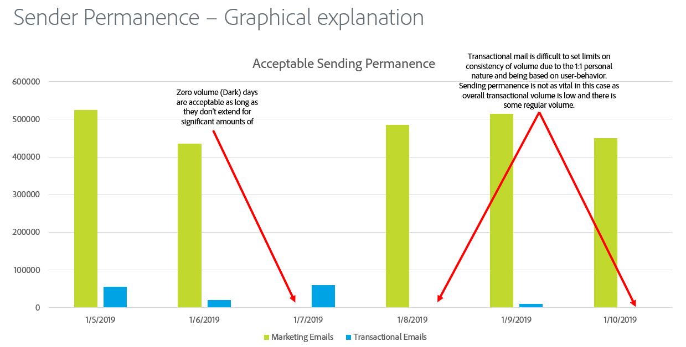

# Permanenza del mittente

La permanenza dell’invio è il processo di definizione di un volume e di una strategia di invio coerenti al fine di mantenere la reputazione dell’ISP. Ecco alcuni motivi per cui la permanenza del mittente è importante:

* Gli spammer solitamente eseguono un &quot;IP address hop&quot;, ovvero spostano costantemente il traffico tra più indirizzi IP per evitare problemi di reputazione.
* La coerenza è fondamentale per dimostrare agli ISP che il mittente è affidabile e non tenta di aggirare eventuali problemi di reputazione derivanti da pratiche di invio inadeguate.
* Mantenere queste strategie coerenti per un lungo periodo di tempo è necessario prima che alcuni ISP considerino affidabile il mittente.

**Di seguito sono riportati alcuni esempi:**

