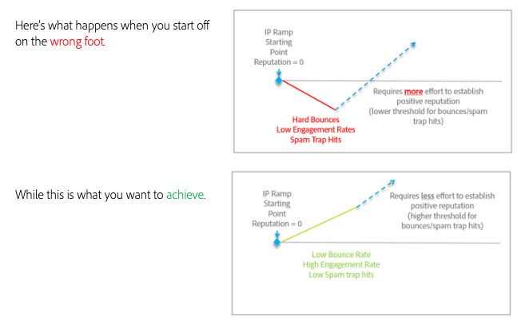

# Effettuare una transizione fluida quando si passa da una piattaforma e-mail a un’altra

Quando si spostano provider di servizi e-mail (ESP), non è possibile effettuare la transizione anche agli indirizzi IP esistenti e stabiliti. È importante seguire le best practice per sviluppare una reputazione positiva al momento di ricominciare. Poiché i nuovi indirizzi IP che utilizzerai non hanno ancora una reputazione, gli ISP non sono in grado di fidarsi completamente delle e-mail provenienti da loro e devono essere cauti in ciò che consentono di consegnare ai loro clienti.

Stabilire una reputazione positiva è un processo. Ma una volta stabilito, piccoli indicatori negativi avranno un impatto minore su di te e sulla tua consegna di e-mail.

Il tempo necessario per riscaldare gli indirizzi IP e i domini può variare, ma un benchmark fino a otto settimane è comune per i mittenti tipici per stabilire una reputazione al massimo presso gli ISP di livello 1 (Gmail, Microsoft, Verizon/Yahoo/AOL, ecc.).

Nelle sezioni successive verranno esaminati alcuni settori chiave su cui concentrarci per integrare correttamente:

1. [Infrastruttura](/help/transition-process/infrastructure.md)
2. [Criteri di targeting](/help/transition-process/targeting-criteria.md)
3. [Considerazioni specifiche dell’ISP durante il riscaldamento dell’IP](/help/transition-process/isp-specific-considerations-during-ip-warming.md)
4. [Volume](/help/transition-process/volume.md)
